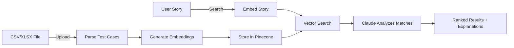
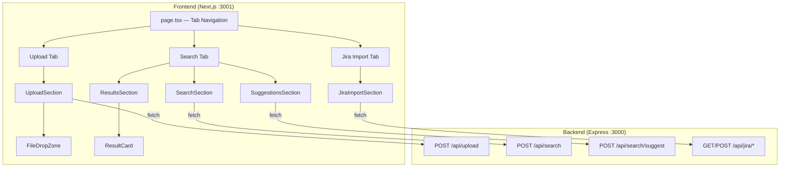
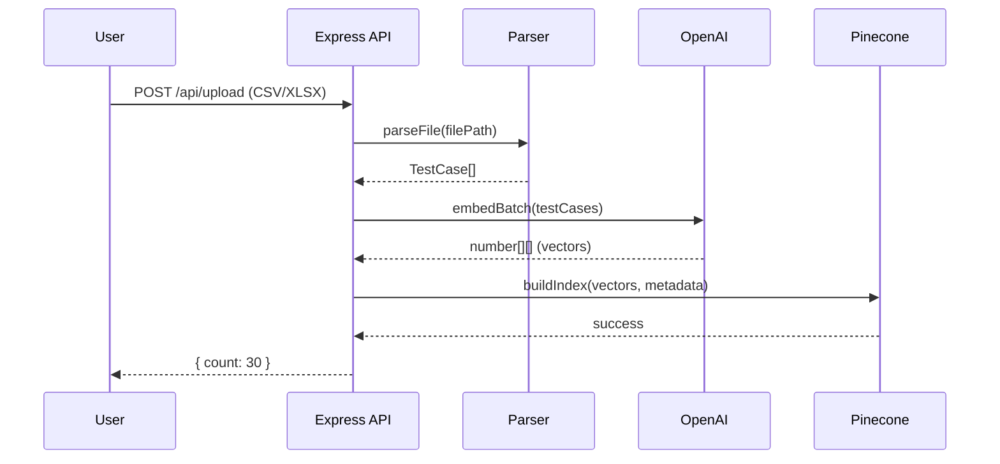
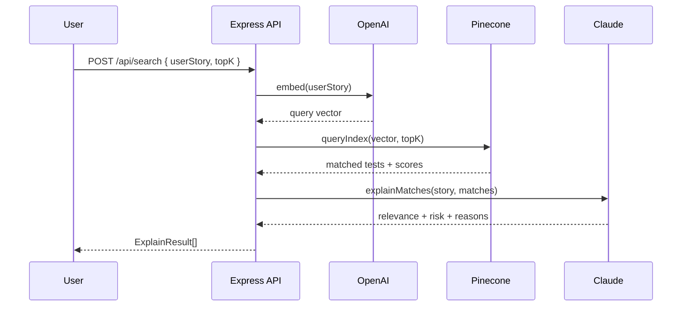

# Test Lens

AI-powered regression test selector. Upload your test cases, describe a user story, and get back the most relevant tests with risk scores and explanations.

## How It Works

Upload a spreadsheet of test cases (or import from Jira/Xray). Type a user story. Get back the tests that matter most — ranked by relevance with AI-generated explanations.



## Quick Start

### Prerequisites

- Node.js 18+
- A [Pinecone](https://www.pinecone.io/) account (free tier works)
- An [OpenAI](https://platform.openai.com/) API key
- An [Anthropic](https://console.anthropic.com/) API key

### Pinecone Setup

Create an index in the Pinecone console:
- **Name:** `testlens`
- **Dimensions:** `1536` (matches text-embedding-3-small)
- **Metric:** `cosine`

### Run the Backend

```bash
cd backend
cp .env.example .env
# Fill in your API keys in .env

npm install
npm run dev
```

Server starts at `http://localhost:3000`

### Run the Frontend

```bash
cd frontend
npm install
npm run dev
```

App starts at `http://localhost:3001`. API requests are proxied to the backend on port 3000.

> **Full setup guide** (Jira, Xray, Docker, all env vars): [docs/setup/environment-setup.md](docs/setup/environment-setup.md)

## Tech Stack

| Component   | Technology |
|-------------|-----------|
| Frontend    | Next.js 16, React 19, TypeScript |
| Styling     | Tailwind CSS 4 |
| Backend     | Express.js, TypeScript |
| Embeddings  | OpenAI text-embedding-3-small |
| Vector DB   | Pinecone |
| LLM         | Anthropic Claude (claude-haiku-4-5) |
| File Parse  | xlsx library |

## Architecture

> **Deep dive:** [docs/system-design.md](docs/system-design.md)



```
test-lens/
├── frontend/
│   └── src/
│       ├── app/            # Next.js pages and layout
│       ├── components/     # React UI components
│       ├── lib/api.ts      # API client
│       └── types/          # TypeScript interfaces
├── backend/
│   └── src/
│       ├── server.ts       # Express entry point
│       ├── routes/         # upload, search, jira route handlers
│       └── services/       # parser, embedder, vectorStore, llm, jira, xray
├── docs/                   # Documentation (see below)
└── README.md
```

## Data Pipelines

> **Deep dive:** [docs/system-design.md — §4–5](docs/system-design.md)

### Upload / Import



Three import sources converge on the same embed → index pipeline:
- **CSV/XLSX** — parsed by `parser.ts`
- **Jira** — summaries + labels via REST API (`jira.ts`)
- **Xray** — test steps + preconditions via GraphQL (`xray.ts`)

### Search & Analysis



## API Reference

> **Full reference (all 11 endpoints):** [docs/api-reference.md](docs/api-reference.md)

| Method | Endpoint | Description |
|--------|----------|-------------|
| `POST` | `/api/upload` | Upload CSV/XLSX test cases |
| `POST` | `/api/search` | Search for relevant tests by user story |
| `POST` | `/api/search/suggest` | Generate missing test case suggestions |
| `GET` | `/api/jira/projects` | List Jira projects |
| `GET` | `/api/jira/issue-types/:projectKey` | List issue types for a project |
| `GET` | `/api/jira/tickets/:projectKey/:issueType` | List tickets by type |
| `GET` | `/api/jira/issues/:projectKey` | List project issues |
| `GET` | `/api/jira/issue/:issueKey` | Get single issue details |
| `POST` | `/api/jira/import` | Import from Jira |
| `POST` | `/api/jira/xray-import` | Import from Xray |
| `GET` | `/api/health` | Health check |

## Data Model

> **Full reference:** [docs/data-model.md](docs/data-model.md)

Key types flowing through the system:

```
CSV/Jira/Xray → TestCase → embedBatch() → Pinecone vectors (with metadata)
                                              ↓
User Story → embed() → queryIndex() → MatchResult[] → explainMatches() → ExplainResult[]
                                                                            ↓
                                                     suggestTestCases() → SuggestedTestCase[]
```

## Architecture Decisions

| ADR | Decision |
|-----|----------|
| [ADR-001](docs/adr/001-embedding-model-choice.md) | `text-embedding-3-small` at 1536 dimensions — fast, cheap, upgradeable |
| [ADR-002](docs/adr/002-dedup-via-sha256-hash.md) | SHA-256 content hash as vector IDs — safe upsert deduplication |
| [ADR-003](docs/adr/003-xray-vs-jira-import.md) | Support both Xray (rich) and Jira (simple) import modes |

## Diagrams

Editable diagrams in [Excalidraw](https://excalidraw.com) format — open at [excalidraw.com](https://excalidraw.com) or with the [VS Code extension](https://marketplace.visualstudio.com/items?itemName=pomdtr.excalidraw-editor).

| Diagram | What it shows |
|---------|---------------|
| [System Architecture](docs/diagrams/system-architecture.excalidraw) | High-level boxes & arrows — Frontend, Backend, external services, Docker Compose |
| [Data Pipeline](docs/diagrams/data-pipeline.excalidraw) | Import pipeline (3 sources → embed → index) and Search pipeline (query → analyze) |
| [Component Tree](docs/diagrams/frontend-component-tree.excalidraw) | React component hierarchy with state, props, and API annotations |
| [Knowledge Graph](docs/diagrams/knowledge-graph.excalidraw) | Mindmap — Data Sources, AI/ML, Storage, Frontend, Infrastructure branches |

## Test Data

Sample files in `backend/test-data/`:
- `sample-tests.csv` — 30 e-commerce regression test cases
- `sample-user-stories.json` — 5 sample user stories for testing search
