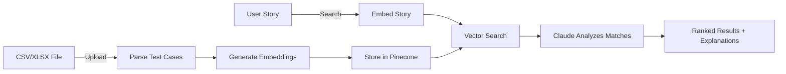
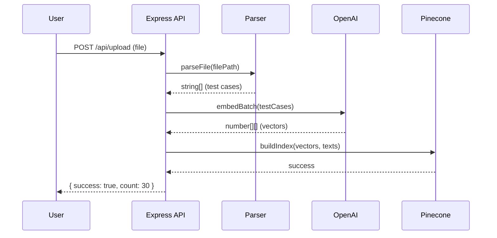
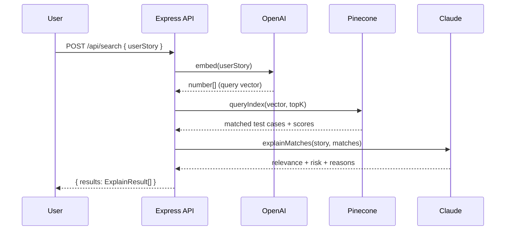
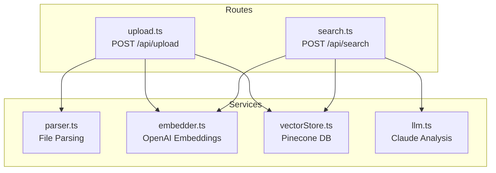

# Test Lens

AI-powered regression test selector. Upload your test cases, describe a user story, and get back the most relevant tests with risk scores and explanations.

## How It Works

Upload a spreadsheet of test cases. Type a user story. Get back the tests that matter most — ranked by relevance with AI-generated explanations.



## Architecture

```
test-lens/
├── frontend/          # UI (separate development)
├── backend/
│   ├── src/
│   │   ├── server.ts          # Express app entry point
│   │   ├── routes/
│   │   │   ├── upload.ts      # POST /api/upload
│   │   │   └── search.ts      # POST /api/search
│   │   └── services/
│   │       ├── parser.ts      # CSV/XLSX file parsing
│   │       ├── embedder.ts    # OpenAI embeddings
│   │       ├── vectorStore.ts # Pinecone vector DB
│   │       └── llm.ts         # Claude analysis
│   ├── test-data/             # Sample test fixtures
│   └── uploads/               # Temp file storage
└── README.md
```

## Upload Flow

User uploads a CSV/XLSX file. The backend parses it, generates embeddings, and stores them in Pinecone.



## Search Flow

User types a user story. The backend embeds it, finds similar test cases, and asks Claude to explain the relevance.



## Service Layer



## Quick Start

### Prerequisites

- Node.js 18+
- A [Pinecone](https://www.pinecone.io/) account (free tier works)
- An [OpenAI](https://platform.openai.com/) API key
- An [Anthropic](https://console.anthropic.com/) API key

### Pinecone Setup

Create an index in the Pinecone console:
- **Name:** `testlens`
- **Dimensions:** `1536` (matches text-embedding-3-small)
- **Metric:** `cosine`

### Run the Backend

```bash
cd backend
cp .env.example .env
# Fill in your API keys in .env

npm install
npm run dev
```

Server starts at `http://localhost:3000`

## API Reference

### `POST /api/upload`

Upload a CSV or XLSX file containing test cases.

| Field | Type | Description |
|-------|------|-------------|
| file  | File | CSV or XLSX with a "Description" column |

**Response:**
```json
{ "success": true, "count": 30 }
```

### `POST /api/search`

Find relevant test cases for a user story.

| Field     | Type   | Required | Description |
|-----------|--------|----------|-------------|
| userStory | string | yes      | The user story to match against |
| topK      | number | no       | Number of results (default: 5, max: 20) |

**Response:**
```json
{
  "userStory": "As a user, I want to reset my password",
  "results": [
    {
      "testCase": "Verify password reset email is sent",
      "relevance": "high",
      "riskScore": 5,
      "reason": "Directly tests the core password reset functionality"
    }
  ]
}
```

### `GET /api/health`

Health check endpoint.

## Tech Stack

| Component   | Technology |
|-------------|-----------|
| Runtime     | Node.js + TypeScript |
| Server      | Express.js |
| Embeddings  | OpenAI text-embedding-3-small |
| Vector DB   | Pinecone |
| LLM         | Anthropic Claude (claude-haiku-4-5) |
| File Parse  | xlsx library |

## Test Data

Sample files are in `backend/test-data/`:
- `sample-tests.csv` — 30 e-commerce regression test cases
- `sample-user-stories.json` — 5 sample user stories for testing search
